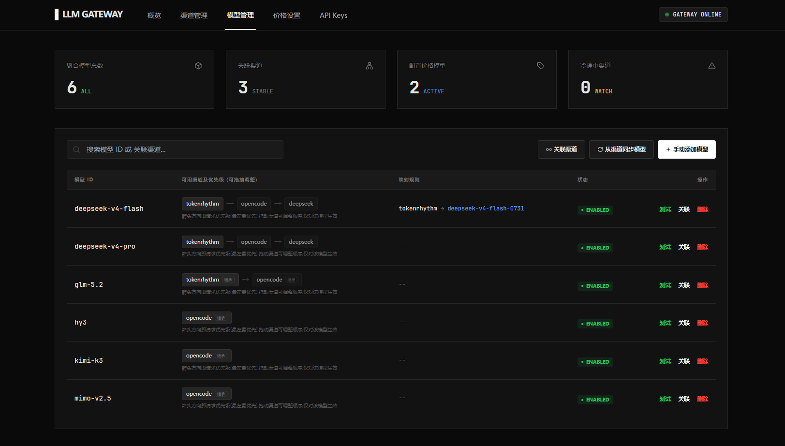

# 大模型转发网关(LLM Gateway)

一个**轻量级大模型渠道管理 + OpenAI 兼容透明转发网关**,面向个人/小团队自用:统一管理多家大模型渠道(官方直连、中转站均可),对外暴露一个 OpenAI 兼容 API,客户端零改造直连。

单文件二进制(前端已内嵌)+ SQLite 单文件数据库,一条命令启动,无需任何外部依赖。

## ⚠️ 重要澄清:网关不聚合接口

**网关本质是一个「密钥轮询回退代理」**:把同一模型关联的多个渠道(`base_url` + `api key`)按优先级排列,请求失败时自动重试同渠道、再按优先级降级到下一渠道,并顺带记录用量统计与成本估算。它**不会**把多个上游"合成"出一个能力更全的接口。

网关对上游**原样透传**——只替换 `base_url` / `api key`(以及可选的模型名映射),不做任何协议转换。因此:

- 客户端能调用哪些接口(`/v1/chat/completions`、`/v1/models` 等)、能用到哪些能力(工具调用、多模态、某些参数或响应字段),**完全取决于所关联的上游渠道本身是否支持**;
- 上游必须是 OpenAI 兼容格式,网关才能透传;
- 不要把它理解成 one-api / new-api 式的"协议聚合层",它不负责把 Anthropic / Gemini 等非 OpenAI 协议转换成 OpenAI 协议。

## 功能特性

- **多渠道管理**:添加/编辑/删除渠道(`base_url` + `api key`),支持自定义鉴权头(如 `x-api-key`),渠道可启用/停用、设置全局优先级,支持拖拽排序批量调整;支持**渠道级超时 / 冷静期**(毫秒,0 回退全局配置)。
- **模型聚合与同步**:一键调用渠道 `/models` 拉取模型列表并勾选关联;不同渠道的同名模型自动合并展示,支持「渠道内模型名」映射(网关模型名 ≠ 渠道实际模型名)。(管理后台**模型列表的合并展示**,不代表接口能力聚合,见"重要澄清")
- **模型级渠道优先级**:同一模型在不同渠道上的顺序可单独拖拽排序,不依赖渠道全局优先级;请求按该顺序分发。
- **智能路由(核心)**:请求按优先级分发;失败先重试同一渠道一次,仍失败则按优先级降级到下一渠道;连续失败触发**渠道冷静期**(默认 10 分钟),期间该渠道不参与路由,到期自动恢复,也可手动解除。
- **模型可用性测试**:对模型的每个关联渠道逐一发送最小流式请求,测出**连通性 / 首字延迟(TTFT)/ 回复速度(token/s)**,方便挑选最优渠道。
- **OpenAI 兼容 API**:对外提供 `/v1/*` 接口(chat/completions、models 等),支持非流式与 SSE 流式,流式末尾 chunk 的 `usage` 会被截获计入统计;接口为**透传性质**,具体能力取决于上游渠道。`/v1/*` 已开启 **CORS**,浏览器端应用(本地网页、Web 工具)可直接跨域调用;管理接口 `/api/admin/*` 不开 CORS 以保安全。
- **三类超时独立控制**:`upstream_timeout`(首次响应/TTFB)、`non_stream_timeout`(非流式完整超时,默认 5 分钟)、`stream_max_duration`(流式最长持续时间,默认 6 分钟),互不干扰;流式收到首包后不会被 TTFB 超时打断(详见[配置说明](#配置说明configjson))。
- **用量统计与成本估算**:每请求记录日志(token 用量、缓存命中、耗时、首次响应时间、状态、错误、调用密钥),按渠道/模型/时间(日/小时)聚合;支持**缓存 token 单独计价**(`price_cache_read`,元/百万 token),自动估算成本。
- **请求日志(管理后台概览)**:按 **渠道 / 模型 / 状态 / 密钥名称 / 关键词(IP、Request ID)** 多维筛选,分页(默认每页 10 条);tokens 列展示 **P(输入)/ C(输出)/ T(总计)** 三档(悬停可看完整说明,蓝色数字为命中缓存的输入 tokens);新增 **Token 速度列**——输出 tokens ÷ 输出耗时(从首次响应到请求结束),直观反映生成速率。
- **API key 管理**:签发多把可命名、可撤销的网关密钥(SHA-256 哈希存储,**明文完整保存在本地数据库**,管理界面可随时查看/复制);日志中记录每次请求所用的密钥名称,便于按密钥筛选排查。
- **零依赖部署**:Go 单二进制(前端 embed)+ SQLite(纯 Go 驱动,免 CGO),Windows / Linux 交叉编译产物开箱即用。
- **管理后台**:内置 Vue3 管理界面(概览看板/日志/渠道/模型/价格/API key),仅限本机访问,无需登录。

## 与一般大模型网关(如 one-api、new-api)的区别

| 维度 | 本项目 | 一般网关(one-api/new-api 等) |
|---|---|---|
| 定位 | 个人/小团队**自用**,追求极简 | 面向多用户/团队,提供配额、计费、用户体系 |
| 用户体系 | 无多用户;管理界面仅本机访问,不设登录;网关侧仅凭 API key 鉴权 | 多用户 + 角色权限 + 令牌配额 + 余额计费 |
| 路由策略 | **优先级 + 同渠道重试 + 降级 + 渠道冷静期**(不做轮询,以最大化缓存命中率) | 通常为加权随机/轮询/负载均衡,侧重多用户公平分发 |
| 转发行为 | **纯透传**:只替换 base_url / api key / 模型映射,不解析、不修改业务内容 | 部分网关会做协议转换、内容过滤、多模型拼接等 |
| 计费 | 仅"成本估算"(按单价粗略预测),非精确计费 | 精确计费、余额扣减、充值系统 |
| 部署形态 | 单二进制 + SQLite,一条命令启动,管理界面内嵌 | 多为前后端分离 + 外部数据库,部署较重 |
| 适用场景 | 个人开发者聚合多个 API 渠道(官方 + 中转),统一 key 给各种客户端用 | 团队共享、对外售卖 API 能力的场景 |

简而言之:**本项目是「自用版智能路由转发器」,不是「商业计费平台」**。若只需把多个模型渠道聚合成一个 OpenAI 兼容入口,并希望优先走质量好/便宜的渠道、故障自动切换,本项目正合适;若需要用户管理、充值计费、多租户配额,请选择 one-api/new-api 等成熟方案。

## 快速开始

### 方式一:下载二进制(推荐)

从 [Releases](https://github.com/nihaozyj7/llm-gateway/releases) 下载对应平台二进制:

- `gateway.exe` — Windows amd64
- `gateway-linux` — Linux amd64(需要 `chmod +x gateway-linux`)

### 方式二:从源码构建

前置要求:Go 1.26+、Node.js 18+。

```powershell
# Windows(当前目录)
./build.ps1

# 仅构建 Linux amd64
./build.ps1 -Linux

# 同时构建 Windows + Linux
./build.ps1 -Windows -Linux
```

脚本会依次:构建前端(`web/npm run build`)→ 编译 Go 单二进制。

手动构建:

```powershell
cd web
npm install
npm run build          # 产物 web/dist(会被 embed 进二进制)
cd ..
go build -o gateway.exe ./cmd/gateway
```

> 注意:`//go:embed web/dist` 要求构建 Go 前 `web/dist` 已存在。

### 启动

```powershell
./gateway.exe -config config.json
```

- 首次启动自动创建 `.data/gateway.db`(SQLite)与 `config.json`(使用默认配置)。
- 默认监听 `:8080`,启动后自动打开浏览器进入管理后台(仅本机可访问,无需登录);如不想要自动打开,在 `config.json` 设 `"open_browser": false`。

## 配置说明(config.json)

| 字段 | 默认 | 说明 |
|---|---|---|
| listen | `:8080` | 监听地址 |
| db_path | `./.data/gateway.db` | SQLite 数据库文件路径 |
| data_dir | `.data` | 数据目录 |
| cooldown_duration | 10m | 渠道冷静时长(连续失败达到阈值后)。**单位纳秒(ns)** |
| cooldown_threshold | 1 | 连续失败多少次触发冷静 |
| upstream_timeout | 60s | **流式**请求**首次响应(TTFB)超时**:请求发起后到收到第一个响应的时间,收到首包后不再受此限制;非流式请求不依赖此值,由 `non_stream_timeout` 整体约束。**单位纳秒(ns)** |
| non_stream_timeout | 5m | **非流式**请求完整超时(含读取完整响应体),默认 5 分钟。**单位纳秒(ns)** |
| stream_max_duration | 6m | **流式**请求最长持续时间:超过后即使仍在输出也判定超时,默认 6 分钟。**单位纳秒(ns)** |
| max_attempts_per_request | 0 | 单请求最多尝试渠道数(0 = 不限) |
| retry_same_channel | true | 失败后是否重试同一渠道一次 |
| log_payloads | true | 是否记录请求/响应体到日志 |
| open_browser | true | 启动后是否自动打开浏览器管理界面(设为 false 可关闭) |
| admin_username / admin_password / session_secret | — | 旧版登录遗留字段,已不再使用,可保留或删除 |

> **时间单位说明**:`cooldown_duration`、`upstream_timeout`、`non_stream_timeout`、`stream_max_duration` 的数值单位为**纳秒(ns)**(Go `time.Duration` 的底层单位),**只接受数字写法**,不要写 `"60s"` 这类带引号的字符串,否则启动会报错。
> 与秒的换算:**1 秒 = 1,000,000,000 纳秒**;1 分钟 = 60,000,000,000 纳秒。
> 默认值等价关系:60s = `60000000000`;5m = `300000000000`;6m = `360000000000`;10m = `600000000000`(即当前 `config.json` 中的写法)。

> **超时语义**(三类独立,互不干扰):
> - `upstream_timeout` = **流式首次响应超时(TTFB)**:仅对流式请求生效,指请求发起后到收到第一个响应的时间;**流式收到首包后不再受此限制**,输出不会被它打断(旧版本把该值误用于整个流式过程,导致未超时的长流式请求被误判超时,本版本已修复);
> - `non_stream_timeout` = **非流式完整超时**:约束整个非流式请求(首次响应 + 读取完整响应体),默认 5 分钟;注意升级后非流式请求超时由旧版的 60s 变为 5 分钟;
> - `stream_max_duration` = **流式最长持续时间**:整个流式请求允许的最长时长,超过后即使仍在输出也判定超时,默认 6 分钟。

> **渠道级超时/冷静期**:渠道的创建/编辑弹窗支持按渠道单独配置「超时(ms)」与「冷静期(ms)」,单位**毫秒**,填 `0`(或留空)表示沿用上表全局配置;渠道级超时对流式 = 首次响应超时(默认 60000ms),对非流式 = 完整请求超时(默认 300000ms)。

## 使用流程

1. **添加渠道**:管理后台 → 渠道 → 添加新渠道,填 `base_url` + `api key`。
   - `base_url` 含不含 `/v1` 均可:网关按 `base_url + (客户端路径去掉 /v1 前缀)` 拼接(例:客户端 `POST /v1/chat/completions` → 上游 `${base_url}/chat/completions`)。
   - 默认鉴权头 `Authorization: Bearer <key>`;特殊渠道可改自定义鉴权头(如 `x-api-key`)。
   - 可选:配置渠道级超时(ms)/冷静期(ms),留空沿用全局。
2. **同步模型**:模型 → 从渠道同步(调用渠道 `/models` 接口),或手动添加。
3. **关联渠道**:模型 → 关联渠道,设置「渠道内模型名」做映射(留空同名透传);可拖拽调整该模型下各渠道的顺序(模型级优先级)。
4. **测试渠道**:模型页可一键「测试」,对每个关联渠道实测连通性 / 首字延迟 / 回复速度,据此调整优先级。
5. **签发 API key**:API Keys → 创建新密钥(可命名),客户端用它调用网关 `POST /v1/chat/completions`(OpenAI 兼容,支持 stream);日志会记录每个请求所用的密钥名称。
6. **配置价格**:价格 → 填写模型单价(**元/百万 token**,可分别填输入 / 输出 / 缓存读取三档),日志与看板展示成本估算。
7. **查看日志**:概览 → 请求日志,支持按渠道 / 模型 / 状态 / 密钥名称 / 关键词筛选;tokens 列(输入/输出/总计)与 Token 速度列帮助判断用量与生成速率;点击行可展开查看请求/响应详情。

客户端使用示例(OpenAI SDK 指向网关即可):

```bash
# curl 非流式
curl http://localhost:8080/v1/chat/completions \
  -H "Authorization: Bearer sk-your-gateway-key" \
  -H "Content-Type: application/json" \
  -d '{"model":"gpt-4o","messages":[{"role":"user","content":"你好"}]}'

# 流式
curl http://localhost:8080/v1/chat/completions \
  -H "Authorization: Bearer sk-your-gateway-key" \
  -H "Content-Type: application/json" \
  -d '{"model":"gpt-4o","messages":[{"role":"user","content":"你好"}],"stream":true}'
```

Python OpenAI SDK:

```python
from openai import OpenAI
client = OpenAI(base_url="http://localhost:8080/v1", api_key="sk-your-gateway-key")
resp = client.chat.completions.create(model="gpt-4o", messages=[{"role": "user", "content": "你好"}])
print(resp.choices[0].message.content)
```

## 部署到 Linux 服务器

```powershell
# 在 Windows 开发机交叉编译
./build.ps1 -Linux
```

将 `gateway-linux` 上传到服务器:

```bash
chmod +x gateway-linux
./gateway-linux -config config.json
```

单文件 + SQLite,无任何依赖。建议用 systemd / supervisor 守护进程。

## 架构

```
┌─────────────┐  /v1/* + API key   ┌──────────────────────────┐
│  OpenAI 客户端 │ ───────────────────▶ │  网关(Go)                │
└─────────────┘                    │  ├─ 鉴权(API key, SHA-256) │
                                   │  ├─ 路由决策(优先级/冷静期) │
                                   │  ├─ 透传代理(+重试/降级)    │
                                   │  ├─ 超时控制(TTFB/非流/流式) │
                                   │  ├─ 统计记录(日志/聚合/成本) │
                                   │  └─ 管理后台 API + Vue3 前端 │
                                   └──────────┬───────────────┘
                                              │ 替换 baseurl+apikey 原样转发
                              ┌───────────────┴───────────────┐
                              ▼              ▼               ▼
                       渠道A(baseurl+key)  渠道B           渠道C…
```

## 开发

### 目录结构

```
cmd/gateway/            入口:启动 HTTP 服务、初始化 DB、挂载前端
internal/config/        配置加载与持久化
internal/model/         SQLite 数据模型
internal/store/         SQLite 存取层(渠道/模型/API key/日志/统计)
internal/route/         路由决策核心(优先级/重试/降级/冷静期/超时控制)+ 上游转发
internal/server/        管理后台 API + 网关 /v1/* API + 日志中间件
internal/sync/          渠道模型列表同步(/models 拉取)
internal/stat/          统计聚合与成本计算
web/                    Vue3 + Vite + Tailwind 前端(构建产物 embed)
```

技术选型:

- 后端:Go 标准库 `net/http`(Go 1.22+ 方法路由),不引重型框架
- 数据库:SQLite,纯 Go 驱动 `modernc.org/sqlite`(免 CGO,交叉编译友好)
- 前端:Vue3 + Vite + Tailwind CSS + ECharts(统计看板)
- 前端产物通过 `//go:embed` 打进二进制

### 路由与冷静期逻辑

```
请求到达 /v1/* → 校验 API key → 解析目标 model
→ 候选渠道 = {含该模型 && enabled && 未冷静} 按优先级升序(模型级优先,否则渠道全局)
→ 取第一个渠道发送:
    ├─ 成功 → 记录日志/用量 → 返回
    ├─ 失败(连接错误/超时/5xx/429):
    │    ├─ 第 1 次:重试同一渠道(重放请求体)
    │    ├─ 仍失败 → failure_count+1,达到阈值则进入冷静(cooldown_until = now + cooldown_duration)
    │    └─ 取下一个优先级渠道,重复上述流程
    └─ 业务错误(其余 4xx)→ 直接返回客户端,不计渠道失败
→ 全部渠道失败 → 返回最后一次错误
冷静到期(惰性判断)→ 自动恢复;管理后台可手动解除
```

### 超时控制逻辑

```
请求 → 判定流式 / 非流式
非流式:context 超时 = 渠道级 timeout ?? non_stream_timeout(默认 5m)
       约束「首次响应 + 读取完整响应体」全过程
流式:  ① TTFB 定时器 = 渠道级 timeout ?? upstream_timeout(默认 60s)
          只约束「请求发起 → 收到首个响应头」,超时判首包失败(可降级重试)
       ② 请求 context 超时 = stream_max_duration(默认 6m)
          约束整个流式过程(含 body 读取),超过即判定流式最长超时;
          收到首包后不再受 TTFB 限制,长流式输出不会被误判超时
```

### 成本计算

价格单位为**元/百万 token**(输入 / 输出 / 缓存读取三档,任一可留空):

```
成本 = 输入价 × (prompt_tokens − cache_read_tokens)/1e6
     + 缓存价 × cache_read_tokens/1e6        (未配置缓存价时按输入价计)
     + 输出价 × completion_tokens/1e6
```

`cache_read_tokens` 取自上游 usage 的 `prompt_tokens_details.cached_tokens`(非流式与流式均支持)。

### 测试

```powershell
go test ./...          # 单元测试(路由决策、冷静期、成本计算、代理转发、超时控制)
```

本地联调 mock:`.superdesign/mock-upstream.js` 提供 OpenAI 兼容上游(node 运行,监听 :9000),可用于验证转发/降级/流式。

### API 一览

管理接口(均限本机 loopback):

```
GET/POST  /api/admin/channels                 渠道 CRUD
GET/PATCH/DELETE /api/admin/channels/{id}
POST      /api/admin/channels/reorder         批量调整渠道全局优先级(拖拽排序保存)
GET/POST  /api/admin/models                   模型管理
GET/PATCH/DELETE /api/admin/models/{id}
POST      /api/admin/models/{id}/reorder      调整某模型的渠道顺序(模型级优先级)
POST      /api/admin/models/sync              从渠道同步模型
POST      /api/admin/models/test              模型可用性测试(逐渠道测 TTFT / 回复速度)
GET/POST  /api/admin/keys                     API key 管理
GET       /api/admin/logs                     请求日志(支持 channel_id / model / status / key_name / keyword / page / page_size)
GET       /api/admin/stats                    聚合统计
POST      /api/admin/stats/reset              清空统计聚合(保留请求日志)
GET       /api/admin/dashboard                看板数据
POST      /api/admin/test                     渠道连通性测试
```

网关接口(API key 鉴权):

```
POST  /v1/chat/completions   对话补全(支持 stream:true)
GET   /v1/models             聚合模型列表(所有启用渠道的模型并集)
```

> 以上均为**透传入口**:网关只负责鉴权、选渠道、重试/降级,并把请求原样转发到上游。具体某个接口或能力(如工具调用、多模态)是否可用,取决于所关联的上游渠道本身是否支持(见"重要澄清")。

## 安全注意事项

- **管理界面仅限本机访问**:`/api/admin/*` 接口只接受 loopback(127.0.0.1 / ::1)请求,来自其他地址一律 403,不设账号密码。
- 网关对外 API(`/v1/*`)不受此限制,依赖 API key 鉴权;已开启 CORS(仅 `/v1/*`)。若需将网关暴露到公网,请通过反向代理将管理端口与对外端口隔离。
- 网关 API key 以 SHA-256 哈希存储用于鉴权,同时为方便本地自用,明文密钥保存在 `key_secret` 字段,管理界面可查看;渠道 API key 在管理界面中遮罩展示。
- 日志中记录的 `api_key_name` 仅为密钥名称(非密钥明文)。
- `config.json` 含渠道凭据信息,勿提交到公开仓库(仓库 `.gitignore` 已默认忽略)。

## 已知限制

- 一期为单用户自用设计,无多用户/配额/余额体系。
- 网关**不聚合/不转换接口能力**:是否支持某个接口或能力(如工具调用、多模态)取决于上游渠道本身,网关只是透传(见上文"重要澄清")。
- 重试可能造成重复计费(上游已计费但响应丢失时,透传网关无法避免)。
- 成本为按单价粗略估算,非精确计费。
- 一期未做 QPS 限流,仅做简单并发控制。

## License

MIT
